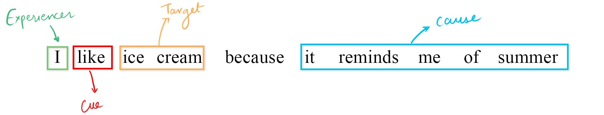
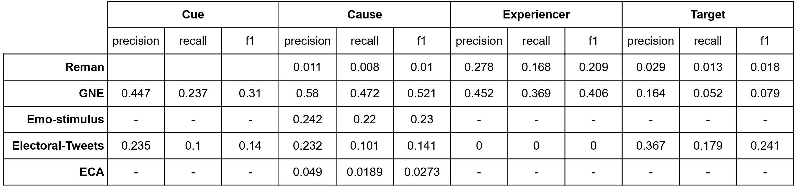

<h1 align="center">Emotion Stimuli</h1>
<hr style="height:10px;border-top:45px solid #fe0" />

<div align="center">


</div>

Emotion classification in text has wide array of applications which include sentiment tracking targetted towards politicians, movies, products, companies, identifying the emotion behind a newspaper headline etc. With the rapid proliferation of text based information processing and a number of social-media websites, there has been a increasing amount of emotion analysis and information mining for researched on newly available datasets. However, historical works has only been focusing solely on detecting certain emotion  ignoring questions such as ‘who feels the emotion? (Experiencer)’, 'towards whom the emotion is directed (Stimulus)?’, 'what provokes the emotion? (Cue)' and 'what is the cause of emotion? (Cause)'. This project has been targeted around the same task using a number of cues for identification of the stated spans. Have a look at the stated sentence below:

<br/>


Project from scratch on Emotion role labelling

Welcome to the project. Please continue your work.

## Installing the package 
If you are running a linux machine with pip installed, then you can install the EmotionStimuli package using pip.
```bash
pip install .
```
In case if you have not installed pip or are facing trouble installing using git, you can install EmotionStimuli package using the provided setup.py
```bash
python setup.py install
```

## Using the package
Once the package has been installed, you can call the package as follows for one particular label. In this case, the label is _"cause"_:
```python
from emotion import HMM

hmm = HMM("cause")
```
The model heavily relies on the structure of [Brown dataset](https://en.wikipedia.org/wiki/Brown_Corpus) and so, we have also added the required respective classes for appropriate conversion which could be imported as follows:
```python
from emotion.utils import Data

# Using the Data class
gne_all = Data(
    filename="data/dataset.json",
    labelset=["experiencer", "target", "cue", "cause"],
    corpora=["gne"],
    splits=[0.8, 0.2],
)

gne_all.conv2brown()
```

The `Data` class can also be used to create dataset splits which could further be used to create various splits in the datasets for training, validation and testing. 

One end to end training of a dataset is provided below for reference. 

```python
from emotion import HMM
from emotion import Evaluation
from emotion.utils import Data
from emotion.dataset import Dataset, Instance

intented_dataset = "gne"
intented_label = "experiencer"

gne_exp = Data(
    filename="data/dataset.json",
    labelset=[intented_label],
    corpora=[intented_dataset],
    splits=[0.8, 0.2],
)

gne_exp.conv2brown()

train = test = Dataset(data=gne_exp, splt=0)
test = Dataset(data=gne_exp, splt=0)

model = HMM(intented_label)
model.train(dataset=train)
model.predictDataset(dataset=test)

# Evaluating the model and saving the outputs
results = Evaluation(dataset=test, label=intented_label, threshold=0.8)
eval_gne_exp.SaveEval("output.txt")
```

## Results
<br/>




## References
1. Oberl&#228;nder, Laura Ana Maria  and Klinger, Roman; [Token Sequence Labeling vs. Clause Classification for {E}nglish Emotion Stimulus Detection](https://www.aclweb.org/anthology/2020.starsem-1.7); Proceedings of the Ninth Joint Conference on Lexical and Computational Semantics, Dec 2020; Association for Computational Linguistics
2. Mohammad, Saif  and Zhu, Xiaodan  and Martin, Joel; [Semantic Role Labeling of Emotions in Tweets](https://www.aclweb.org/anthology/W14-2607); Proceedings of the 5th Workshop on Computational Approaches to Subjectivity, Sentiment and Social Media Analysis; Jun 2014; Association for Computational Linguistics.