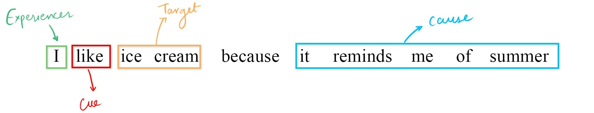

.. EmotionStimuli documentation master file, created by
   sphinx-quickstart on Sun Jun 13 16:39:04 2021.
   You can adapt this file completely to your liking, but it should at least
   contain the root `toctree` directive.

Emotion Stimuli documentation
#############################
Please use the below options to browse through the entire corpus or explore specific detailed documentation.

* :ref:`genindex`
* :ref:`modindex`
* :ref:`search`

Indices and tables
==================

.. toctree::
  :maxdepth: 3
  :caption: Contents:
   usage/installation
   usage/quickstart
    
   modules

.. toctree::
  :maxdepth: 2

  setup
  using

What is Emotion Stimuli?
------------------------
Emotion classification in text has wide array of applications which include sentiment tracking targetted towards politicians, movies, products, companies, identifying the emotion behind a newspaper headline etc. With the rapid proliferation of text based information processing and a number of social-media websites, there has been a increasing amount of emotion analysis and information mining for researched on newly available datasets. However, historical works has only been focusing solely on detecting certain emotion ignoring questions such as ‘who feels the emotion? (Experiencer)’, 'towards whom the emotion is directed (Stimulus)?’, 'what provokes the emotion? (Cue)' and 'what is the cause of emotion? (Cause)'. This project has been targeted around the same task using a number of cues for identification of the stated spans. Have a look at the stated sentence below:

Experiments
===========

The module contains three experimental setups.

.. toctree::
  :maxdepth: 1

  hmm
  embb
  srl
